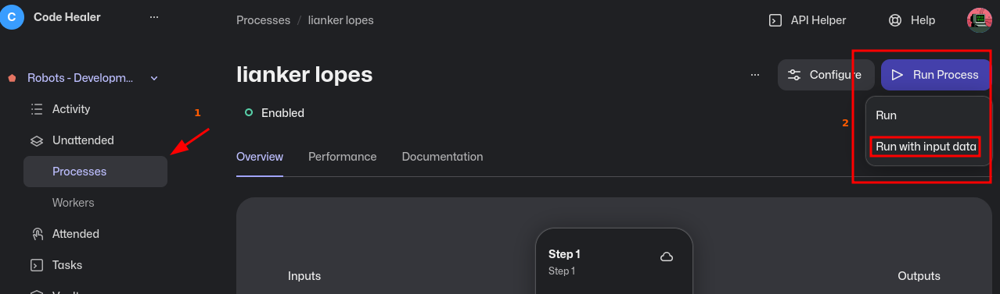
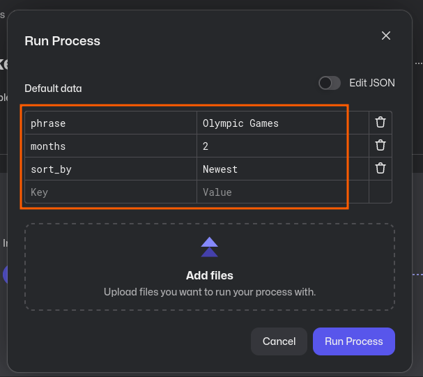
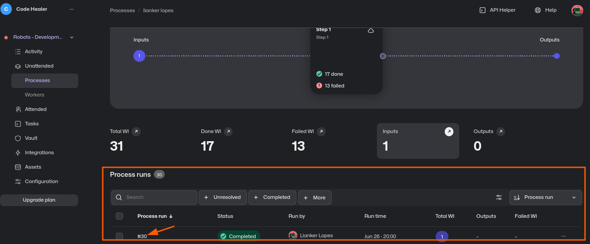
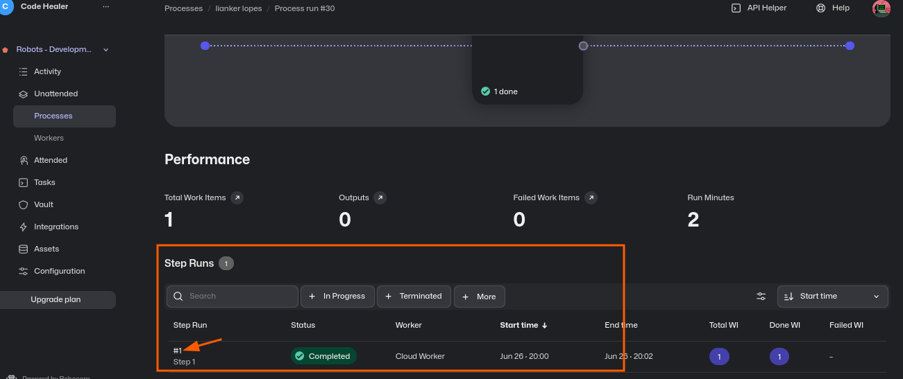
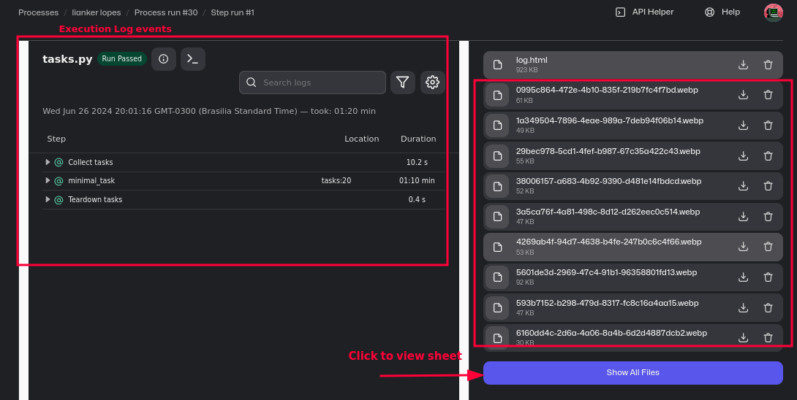
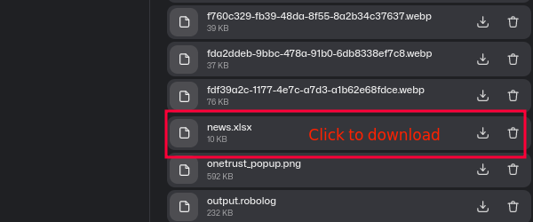

# Obtaining News!

This project aims to automatically fetch news from a specialized website, in this case, The Associated Press.

## Links

- website: https://apnews.com/
- Repository: https://github.com/Code-Healer/news-robot
- Robocorp: https://robocorp.com/

## How the Robot Works

The robot can search for news based on a phrase and then save the results in an Excel spreadsheet. It is also possible to specify the number of months, from the current month, to extract the news from the results, which can be sorted by Relevance, Newest, or Oldest.

The returned spreadsheet will contain fields processed from the data extracted from the website. The fields are described below:

- title: The title of the news;
- description: The description text;
- post_date: The posting timestamp;
- img_file_name: The image name generated from an ID given to the news;
- have_money_values: Whether there is any text corresponding to monetary values;
- count_of_search_phrase: The number of times the search phrase appears in the title or description.

In addition to the spreadsheet, images related to the news will also be downloaded.

### Parameters

- phrase: must be a text;
- months: a positive integer;
- sort_by: "Relevance | Newest | Oldest"

Below is an example of use:

```json
{
    "phrase": "Olympic Games",
    "months": 2,
    "sort_by": "Newest"
}
```

## Running in Robocorp

To run process (robot) in Robocorp Cloud follow instructions below:

1. Click in Organization _Code Healer_ and select _Processess_ in Unatended menu
item.

2. Then select `run with input data` in Run Process button




3. Fill items as described above, follow the image to search by Olimpic Games!



4. Wait until process finish, you can visualize results clicking on link in the _process run_ column as below



5. On the next screen in performance section, click in link of _step run_ column



6. In the next screen you can see results, logs, files and the button to expand and see all assets



7. Clicking in button, and scrolling down, the spreadsheet can be found and downloaded


